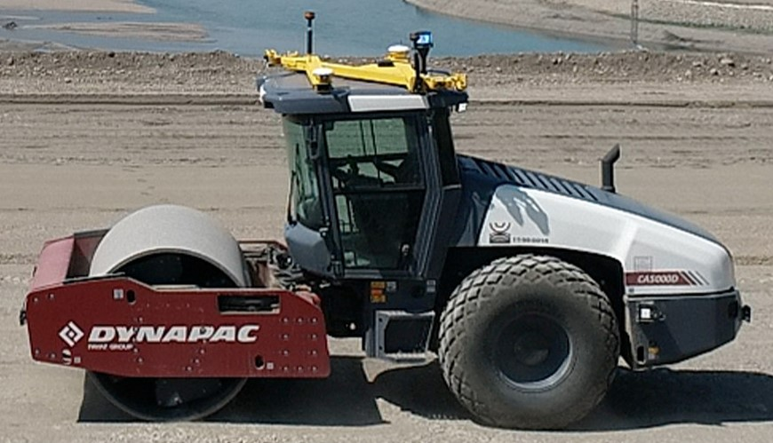

# Radar-Odometry-for-Trimble-Autonomous-Soil-Compactor

This project was completed for Trimble in colaboration with a team from the University of Colorado Boulder. The objective was to calculate the autonomous soil compactor's change in position relative to its starting location.

Radar data is received in batches at a variable frequency, typically between 10-18Hz.
These batches are referred to throughout this code as epochs.

At each epoch:
- The data from each radar is rotated to face directly forward
    - The correct rotation for each radar is determined by its known placement on the machine
        and supplemented by the results of a calibration algorithm that fine tunes these adjustments
        (see calibration_test.py)
    
- This adjusted radar data is compiled into two matrices:
    - A matrix consists of [cos(az),sin(az)] for each entry 
   b matrix consists of radial speeds
    
- A RANSAC implementation from the sklearn library then:
    - Non-deterministically discards outliers in the data
    - Runs a linear regression on the remaining data, i.e., velocity = (AT A)^-1 (ATb)
    - The resulting 1x2 velocity vector is in the form [v_x, v_y]
    
- The machine's location on the x-y plane is updated according
    to this velocity and the length of the epoch in seconds
